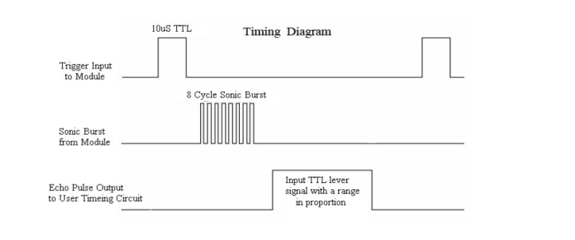
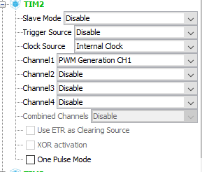
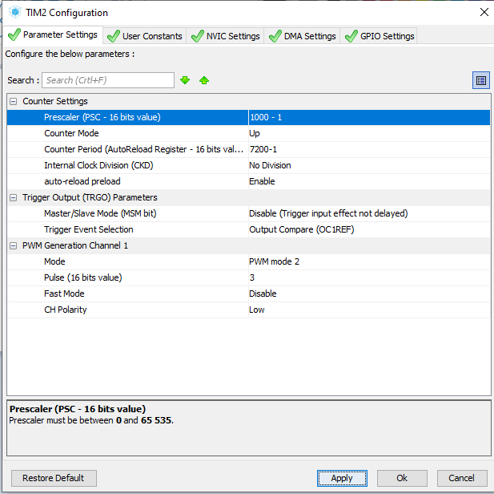
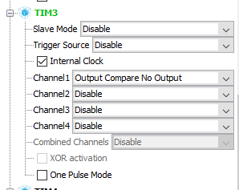
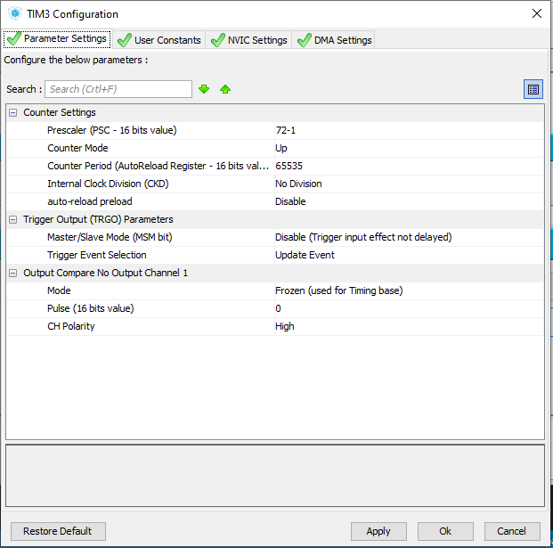
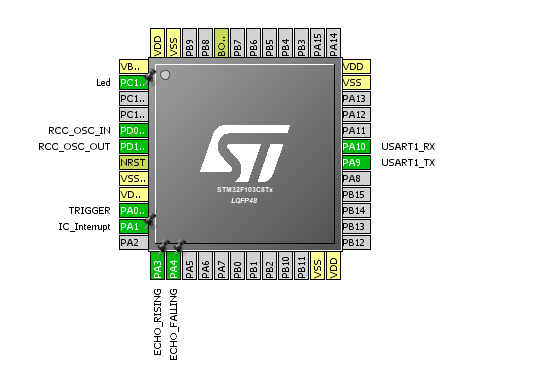
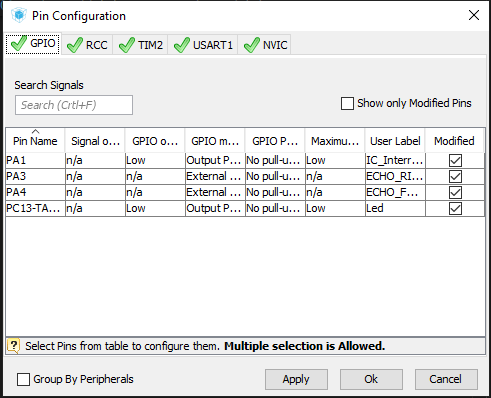
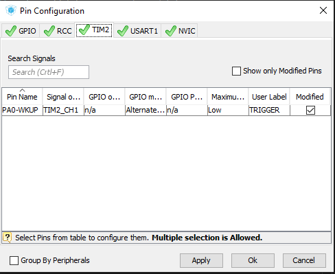
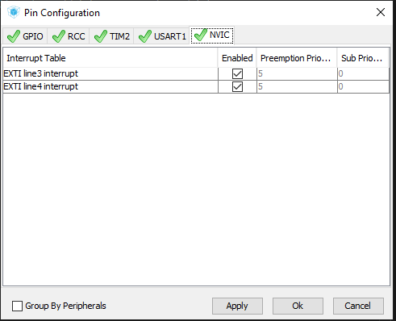

## HC-SR04

Segundo o datasheet, o sensor ultrassônico HC-SR04 é disparado com um pulso de 10us no terminal trigger. Após isso, o sensor responderá com um pulso de largura proporcional ao tempo de ida e volta do som. O diagrama de tempo é mostrado na imagem abaixo:

A distância pode ser determinada pela equação:

$$
 d = v * (t/2)
$$

Onde v é a velocidade do som ~= 340m/s
E t é a largura do pulso no pino ECHO, que correspondeao tempo de ida e volta.

## Esquemático

O diagrama abaixo mostra o esquema de ligação elétrica entre o stm32 e o hc-sr04

PA0 - Conectado ao pino TRIGGER, gerando um pulso de 10us.
PA3 - Conectado ao pino ECHO, interrupção borda de subida.
PA4 - Conectado ao pino ECHO, interrupção borda de descida.

## STM32CubeMX

Para gerar o sinal de trigger, o timer2 foi utilizado na configuração PWM. Este TIM2 gera um pulso de 10us em PA0 a cada 100ms.

Para medir o sinal no pino ECHO do sensor, o pino PA3 inicia a contagem do timer 3, quando ocorre uma interrupção pela borda de subida do sinal. Quando ocorre a borda de descida em PA4, a contagem é interrompida e também é obtido o valor do contador do timer. Este timer (TIM3), foi configurado com um preescaler de 72, para obter uma contagem a cada 1us.

### Configuração TIM2

### Configuração TIM3

### GPIO

